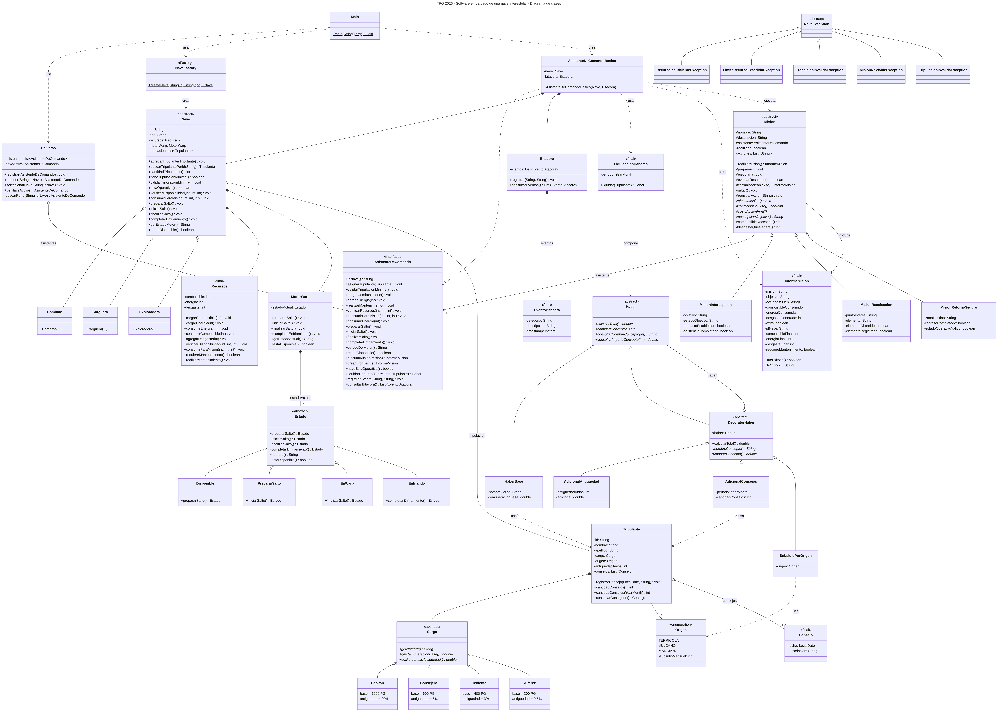

# TPG_Programacion

Software embarcado de una nave interestelar tripulada — TPG 2026, Programación C.

## Requisitos

- JDK 17 o superior
- Maven 3.8 o superior

## Configuración local

No requiere configuración adicional: no usa base de datos, archivos externos ni
variables de entorno. Alcanza con tener instalados el JDK y Maven.

## Compilación

```
mvn clean compile
```

## Ejecución

```
mvn exec:java
```

El programa no pide datos por consola: ejecuta de corrido los cinco escenarios de
demostración y escribe el resultado en pantalla. Para guardarlo en un archivo:

```
mvn -q exec:java > docs/ejecuciones.txt
```

Sin Maven, desde la raíz del proyecto:

```
javac -encoding UTF-8 -d target/classes $(find src/main/java -name "*.java")
java -cp target/classes ar.edu.unmdp.tpg.app.Main
```

En PowerShell la compilación se escribe así:

```
javac -encoding UTF-8 -d target\classes (Get-ChildItem -Recurse src\main\java -Filter *.java).FullName
java -cp target\classes ar.edu.unmdp.tpg.app.Main
```

## Escenarios de la demostración

`Main` arranca creando las tres naves con `NaveFactory`, les asigna su tripulación
y las registra en el `Universo`. Después recorre estos escenarios:

| Escenario | Qué demuestra | Resultado esperado |
|---|---|---|
| A | Ejecución correcta de M-01, M-02 y M-03 sobre EXP-1 | Las tres misiones son exitosas. La nave pasa de 60/80/0 a 48/70/12 en combustible, energía y desgaste. El motor recorre el ciclo completo de salto y vuelve a Disponible. |
| B | Límite de recursos: recolecciones sucesivas sobre CAR-1 hasta el rechazo | Se completan 12 recolecciones; la nº 13 se rechaza en la preparación por energía insuficiente y **no modifica ningún recurso**. La nave queda en 52/0/48. |
| C | Motor Warp: ciclo válido y transiciones inválidas sobre COM-1 | El ciclo Disponible → Preparando salto → En warp → Enfriamiento → Disponible funciona. Cada transición inválida se rechaza con su excepción y el motor conserva su estado. |
| D | Contrato inválido y mantenimiento | Las cargas fuera de rango se rechazan sin tocar los recursos. El mantenimiento deja el desgaste en 0. |
| Haberes | Liquidación con Decorator, período octubre 2026 | Capitán 3020 PG, Consejero 786 PG, Teniente 454 PG, Alférez 221 PG. Del consejero se cuentan solo los 3 consejos del período liquidado; el de otro mes queda afuera. |

La salida completa de una corrida está en [`docs/ejecuciones.txt`](docs/ejecuciones.txt).

## Verificación

Para verificar la entrega:

1. Compilar con `mvn clean compile`.
2. Ejecutar con `mvn exec:java`.
3. Comparar la salida con los resultados esperados de la tabla de escenarios.

En [`docs/evidencias.md`](docs/evidencias.md) está, para cada requerimiento E1 y cada
evidencia mínima exigida, dónde se verifica y qué resultado se espera.

## Diagrama de clases



El diagrama está en [`docs/uml-clases.png`](docs/uml-clases.png) y en
[`docs/uml-clases.svg`](docs/uml-clases.svg). El fuente, en Mermaid, es
[`docs/uml-clases.mmd`](docs/uml-clases.mmd).

## Patrones de diseño

| Patrón | Dónde está | Cómo se aplica |
|---|---|---|
| **Factory** | `naves.NaveFactory` | Único punto de creación de naves. El cliente pide un tipo y recibe la nave con sus recursos iniciales y su motor ya armados. Los constructores de `Combate`, `Carguera` y `Exploradora` son package private, así nadie crea una nave con valores que no le corresponden. |
| **State** | `motorwarp.MotorWarp` y `motorwarp.Estado` | El motor no decide con `if` qué transición es válida: se la pide a su estado actual, y cada estado devuelve el siguiente o lanza `TransicionInvalidaException`. Agregar un estado es agregar una subclase. |
| **Template Method** | `mision.Mision` | `realizarMision()` es `final` y fija el orden preparar → ejecutar → evaluarResultado → cerrar. Las misiones concretas solo completan los puntos de extensión (`ejecutaMision`, `condicionDeExito`, `costoAccionFinal`, `descripcionObjetivo`, `combustibleNecesario`, `desgasteQueGenera`), nunca la secuencia. |
| **Decorator** | `haberes.Haber`, `haberes.DecoratorHaber` | `HaberBase` tiene el sueldo del cargo; cada adicional envuelve un haber y le suma su concepto. Las combinaciones se arman encadenando decoradores en `LiquidacionHaberes`, sin una subclase por combinación posible. |

## Asistente de Comando

`AsistenteDeComando` es la única vía entre el cliente y la nave. Conoce a la vez la
nave, las misiones y la bitácora; las misiones no conocen ninguna de las tres: le
piden al asistente que verifique recursos, los consuma, ordene al motor y registre
lo ocurrido. Esto deja a `Mision` independiente de `Nave` y de `Bitacora`.

El `Universo` guarda los asistentes, no las naves, y depende de la interfaz: acepta
cualquier variante de asistente sin modificarse.

## Manejo de excepciones

Todas las fallas del dominio derivan de `NaveException`, que extiende `Exception`
(checked), de modo que quien invoca una operación está obligado a decidir qué hace
con el error. Las excepciones son cinco:

| Excepción | Cuándo se lanza |
|---|---|
| `RecursoInsuficienteException` | La operación necesita más combustible o energía del disponible. |
| `LimiteRecursoExcedidoException` | La operación dejaría un recurso por encima de 100. |
| `TransicionInvalidaException` | Se le pide al Motor Warp una transición que su estado actual no admite. |
| `MisionNoViableException` | La misión no puede iniciarse, o ya fue realizada. |
| `TripulacionInvalidaException` | La nave no cumple la composición mínima de tripulación. |

Las operaciones que las lanzan son atómicas: una operación rechazada no modifica
ningún recurso ni el estado del motor. El Asistente de Comando captura las fallas
en el borde del sistema, las registra en la bitácora con categoría `ERROR` y las
vuelve a propagar.

## Contratos

Las clases públicas están documentadas con Javadoc, indicando precondiciones,
postcondiciones e invariantes. Los contratos de las operaciones sobre la nave están
en la interfaz `AsistenteDeComando`, que es el contrato que ve el cliente.

Para generar la documentación:

```
mvn javadoc:javadoc
```

## Estructura de paquetes

Todo el código está bajo `src/main/java/ar/edu/unmdp/tpg/`:

| Paquete | Contenido |
|---|---|
| `app` | `Main`: el programa de demostración. Es la única clase que usa la consola. |
| `universo` | `Universo`: registra las naves listas para operar y elige con cuál se trabaja. |
| `asistente` | `AsistenteDeComando` y `AsistenteDeComandoBasico`: la vía entre el cliente y la nave. |
| `naves` | `Nave`, tipos de nave, `NaveFactory`, `Recursos` |
| `motorwarp` | `MotorWarp` y sus estados (patrón State) |
| `mision` | Misiones M-01, M-02, M-03 (patrón Template Method) e `InformeMision` |
| `tripulacion` | `Tripulante`, cargos, `Origen`, `Consejo` |
| `haberes` | Liquidación de haberes (patrón Decorator) |
| `bitacora` | `Bitacora` y `EventoBitacora` |
| `excepciones` | Excepciones del dominio |
